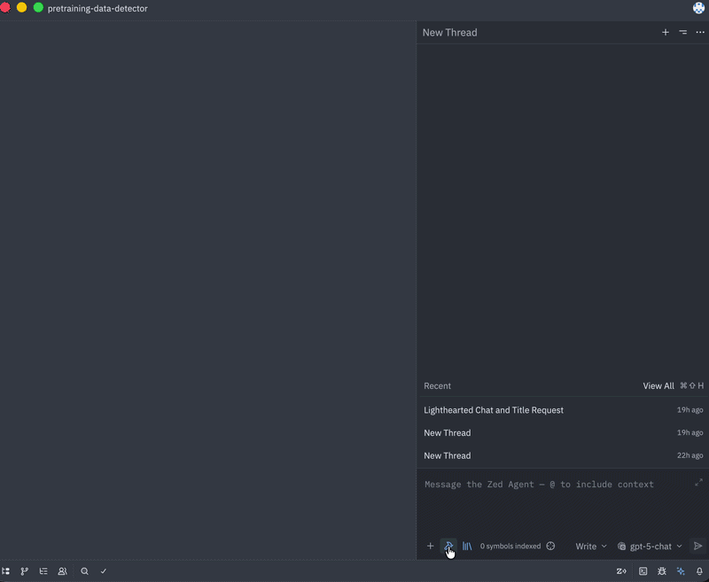
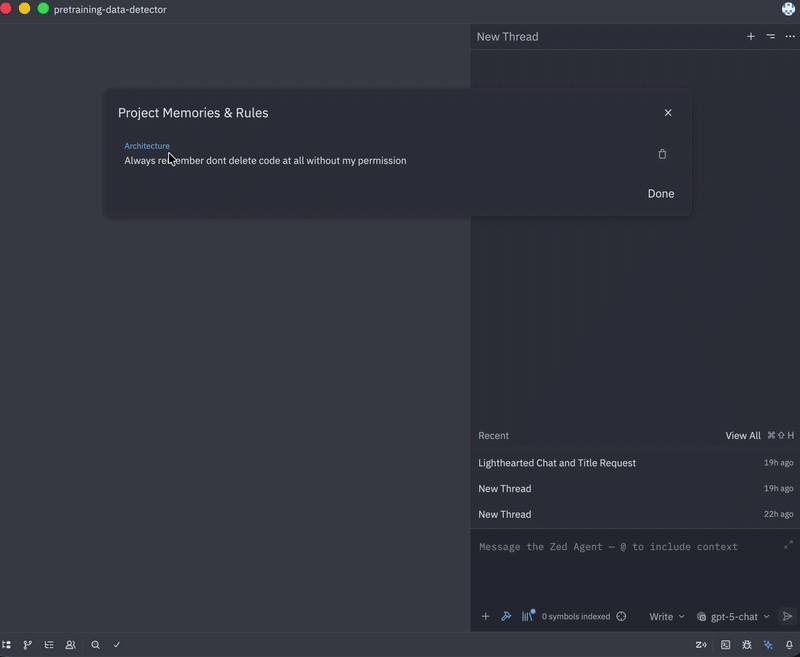
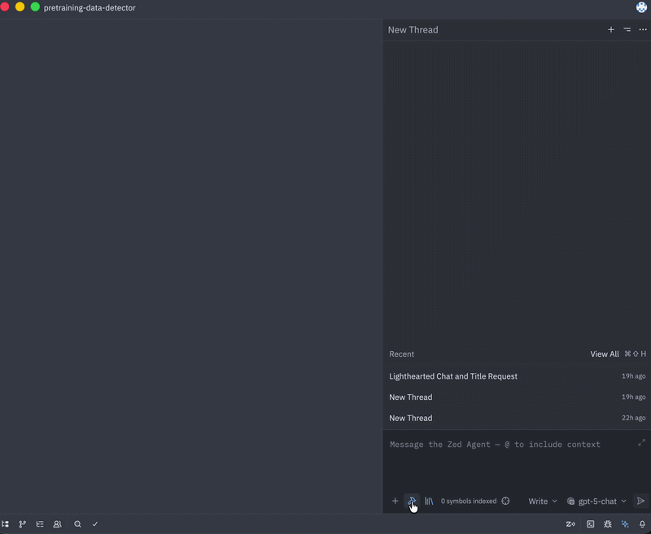

# Zed Custom - Enhanced AI Agent Features

This is a custom fork of [Zed](https://github.com/zed-industries/zed) with enhanced AI agent capabilities focused on improving code understanding and long-term memory.

## 🚀 Custom Features

### 1. **LSP-Based Symbol Search** 
**Status:** ✅ Implemented

Replaced the original regex-based semantic indexing with native Language Server Protocol (LSP) integration for accurate, language-aware symbol navigation.

**Benefits:**
- ⚡ **Faster**: No CPU-intensive background indexing
- 🎯 **More Accurate**: Leverages language servers (rust-analyzer, pyright, gopls, etc.)
- 🔧 **Type-Aware**: Understands code structure, not just text patterns
- 🔄 **Always Up-to-Date**: Automatically maintained by LSP as you edit

**Implementation:**
- [`crates/agent/src/tools/context_tool.rs`](crates/agent/src/tools/context_tool.rs) - New LSP-based context tool
- [`crates/agent/src/agent.rs`](crates/agent/src/agent.rs) - Disabled legacy regex indexing
- [`crates/agent/src/thread.rs`](crates/agent/src/thread.rs) - Updated tool initialization

**Commit:** [`91b74d68c6`](https://github.com/shotsan/zed-custom/commit/91b74d68c6)

---

### 2. **Agent Memory System: `remember`**
**Status:** ✅ Implemented

The AI agent can proactively remember critical information using the built-in memory tools to store it in a persistent SQLite database tying knowledge directly to specific projects across editor restarts.

**Example Usage:**
```
User: "Remember that this project uses a microservices architecture with gRPC for inter-service communication"
Agent: Uses the 'remember' tool to permanently store this under the 'Architecture' category.
```


---

### 3. **Agent Memory System: `recall`**
**Status:** ✅ Implemented

The agent can retrieve previously stored memories using the recall tools to instantly pull up context stored days or weeks ago without needing to re-read files.

**Example Usage:**
```
[Later session]
User: "What architecture does this project use?"
Agent: Uses the 'recall' tool to retrieve the microservices architecture memory stored previously.
```


---

### 4. **Instant Web Search**
**Status:** ✅ Implemented

Integrated a full headless Chrome engine (`chromiumoxide`) mapped to a user-invokable `/search` slash command. This allows the agent to pull real-time information from the web directly into your editor context.

**Features:**
- 🔍 **Web Search**: Type `/search <query>` to instantly fetch DuckDuckGo results.
- 🔗 **Deep Dive**: The agent can navigate and extract rendered Markdown from websites (even JavaScript-heavy React SPAs).

**Example Usage:**
```
User: "/search latest tailwind css features"
Agent: Fetches the search results and synthesizes the latest framework changes without leaving Zed.
```


---

### 5. **Azure Anthropic & Token Caching UI** 
**Status:** ✅ Implemented

Enhanced support for Azure Anthropic deployments and natively enabled token caching visualization to help developers optimize their context reuse without manual config hacking.

**Features:**
- ☁️ **Azure Ready**: Passes exact `serde_name` string models to Azure APIs to resolve `404 DeploymentNotFound` errors natively.
- 💾 **Token Caching UI**: Enabled `show_turn_stats` by default so users automatically see the `+X saved` and `X cached` badges without tweaking `settings.json`.


**Implementation:**
- [`crates/anthropic/src/anthropic.rs`](crates/anthropic/src/anthropic.rs) - Added `serde_name()` context to Model enums
- [`crates/language_models/src/provider/anthropic.rs`](crates/language_models/src/provider/anthropic.rs) - Preserved model name transparently
- [`crates/agent_ui/src/agent_ui.rs`](crates/agent_ui/src/agent_ui.rs) - Flipped default config

---

## 🔧 Setup & Usage

### Building from Source

```bash
# Clone this repository
git clone https://github.com/shotsan/zed-custom.git
cd zed-custom

# Build Zed
cargo build --release

# Run
cargo run
```

### Syncing with Upstream Zed

This repository maintains `zed-industries/zed` as an upstream remote:

```bash
# Fetch latest from official Zed
git fetch upstream

# Merge upstream changes
git merge upstream/main

# Push to your fork
git push origin main
```

---

## 📝 Configuration Files

Custom project-specific rules can be defined in:
- `.cpp_rules` - C++ specific coding guidelines
- `.python_rules` - Python specific coding guidelines

---

## 🤝 Contributing

This is a personal fork with experimental features. If you find these features useful:
1. Consider contributing improvements via pull requests
2. Report issues specific to custom features
3. For core Zed issues, please report to [zed-industries/zed](https://github.com/zed-industries/zed)

---

## 📜 License

Same as [Zed](https://github.com/zed-industries/zed) - see their LICENSE files.

---

## 🔗 Links

- **Upstream Zed:** https://github.com/zed-industries/zed
- **This Fork:** https://github.com/shotsan/zed-custom

---

## 📊 Feature Comparison

| Feature | Upstream Zed | This Fork |
|---------|-------------|-----------|
| Symbol Search | Regex-based | ✅ LSP-based |
| Agent Memory | ❌ Session-only | ✅ Persistent SQLite |
| Background Indexing | Heavy CPU usage | ✅ Disabled (uses LSP) |
| Memory Categories | N/A | ✅ 5 categories |
| Cross-Session Context | ❌ | ✅ Yes |
| Web Search (/search) | ❌ | ✅ Instant DuckDuckGo |
| JS-Heavy Browsing | ❌ | ✅ Headless Chrome |
| Azure Anthropic | ❌ Needs proxy | ✅ Transparently |
| Token Caching UI | ❌ Hidden | ✅ Enabled by Default |


---

**Last Updated:** 2026-02-24
# Zed

[](https://zed.dev)
[](https://github.com/zed-industries/zed/actions/workflows/run_tests.yml)

Welcome to Zed, a high-performance, multiplayer code editor from the creators of [Atom](https://github.com/atom/atom) and [Tree-sitter](https://github.com/tree-sitter/tree-sitter).

---

### Installation

On macOS, Linux, and Windows you can [download Zed directly](https://zed.dev/download) or install Zed via your local package manager ([macOS](https://zed.dev/docs/installation#macos)/[Linux](https://zed.dev/docs/linux#installing-via-a-package-manager)/[Windows](https://zed.dev/docs/windows#package-managers)).

Other platforms are not yet available:

- Web ([tracking issue](https://github.com/zed-industries/zed/issues/5396))

### Developing Zed

- [Building Zed for macOS](./docs/src/development/macos.md)
- [Building Zed for Linux](./docs/src/development/linux.md)
- [Building Zed for Windows](./docs/src/development/windows.md)

### Contributing

See [CONTRIBUTING.md](./CONTRIBUTING.md) for ways you can contribute to Zed.

Also... we're hiring! Check out our [jobs](https://zed.dev/jobs) page for open roles.

### Licensing

License information for third party dependencies must be correctly provided for CI to pass.

We use [`cargo-about`](https://github.com/EmbarkStudios/cargo-about) to automatically comply with open source licenses. If CI is failing, check the following:

- Is it showing a `no license specified` error for a crate you've created? If so, add `publish = false` under `[package]` in your crate's Cargo.toml.
- Is the error `failed to satisfy license requirements` for a dependency? If so, first determine what license the project has and whether this system is sufficient to comply with this license's requirements. If you're unsure, ask a lawyer. Once you've verified that this system is acceptable add the license's SPDX identifier to the `accepted` array in `script/licenses/zed-licenses.toml`.
- Is `cargo-about` unable to find the license for a dependency? If so, add a clarification field at the end of `script/licenses/zed-licenses.toml`, as specified in the [cargo-about book](https://embarkstudios.github.io/cargo-about/cli/generate/config.html#crate-configuration).

